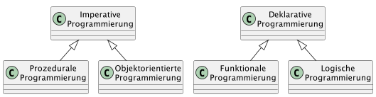
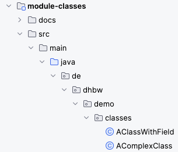
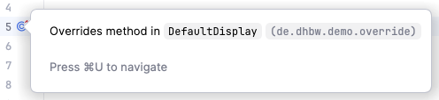
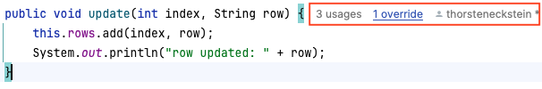
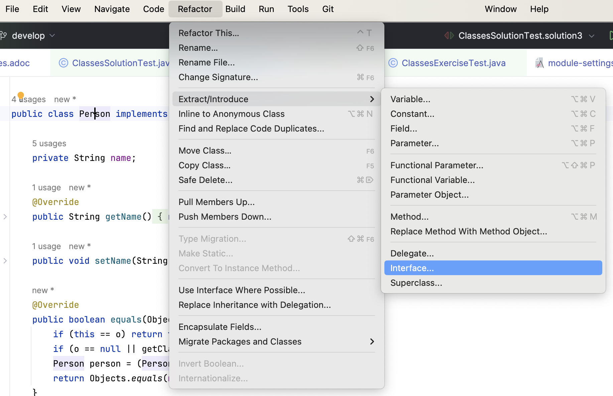

include::../../docs/settings.adoc[]
//include::module-settings.adoc[]
:author: Thorsten Eckstein

// table of contents
:toc:

////
  Folgendes wird in "course-structure.adoc"
  aus jedem Modul zusammengeführt:

tag::content[]
----
1. Objektorientierte Programmierung
2. Organisation & Nutzung von Java Klassen
3. Klassen & Instanzen
4. Vererbung
5. Polymorphismus
6. Überladen & Übersteuern (Überschreiben)
----
end::content[]
////

== Objektorientierte Programmierung

Im Wesentlichen stehen sich 2 *Programmierparadigmen* gegenüber:

* das *imperative* Paradigma, aus dem sich OOP *objektorientierte Programmierung* entwickelte, und
* das *deklarative* Paradigma, das die Grundlage für die _funktionale Programmierung_ bildet.

Die *objektorientierte Programmierung (OOP)* ist dabei eine Programmiermethodik, die die reale Welt in Form von Objekten und deren Beziehungen abbildet.

In Java wird diese Methode durch die Verwendung von *Klassen* und *Objekten* umgesetzt, wodurch Programme übersichtlicher und wartbarer werden (sollen).

DIe wesentlichen Grundkonzepte der OOP bzw. deren vier fundamentale Prinzipien sind:

. *Klassen*: Als Baupläne oder Vorlagen für Objekte
. *Objekte*: Konkrete Instanzen einer Klasse
. *Vererbung*: Übernahme von Eigenschaften und Verhalten
. *Kapselung*: Verbergen interner Details

Die objektorientierte Programmierung bietet dabei verschiedene Vorteile, die folgendermaßen zusammengefasst werden können:

* *Wiederverwendbarkeit*: Code kann in verschiedenen Kontexten genutzt werden
* *Verständlichkeit*: Programme können in logische Einheiten aufgeteilt und damit besser verstanden werden
* *Modularität*: Verschiedene Programmteile können unabhängig entwickelt werden
* *Bessere Wartbarkeit*: Änderungen sind einfacher durchzuführen

Diese Struktur ermöglicht es, komplexe Programme zu erstellen, die nah an der realen Welt, leicht zu verstehen und (so das Versprechen) leichter zu warten sind.

Das lässt sich an folgendem Beispiel verdeutlichen, bei dem es um eine *Kundenanforderung* geht und in einem technischen Modell umgesetzt werden soll.

====
//tag::scenario[]
Die Gaming-Plattform _Electron_ beauftragt die Entwicklung einer Spieler-Datenbank.
Es soll erfasst werden, welche Arten von Spielen die Spieler bevorzugen,
um Empfehlungen zu generieren. Empfehlungen sollen auch auf Basis der Interessen
anderer Spieler erfasst werden.
//end::scenario[]
====

Vor diesem Hintergrund werden oft auch konkrete *Anforderungen* genannt, z.B. ...

* Es sollen Spiele und Spieler erfasst werden.
* Für Spiele sollen ein Name und das Genre gespeichert werden.
* Für Spieler soll erfasst werden, welche Spiele sie besitzen und wie oft sie diese spielen.
* Auf Basis dieser Daten sollen Empfehlungen für neue Spiele generiert werden können.
Ein Spiel soll empfohlen werden, wenn der Spieler es noch nicht besitzt und
es zu einem Genre gehört, das der Spieler mag oder es ein anderer Spieler mag,
mit dem der Spieler oft interagiert.

[plantuml, align="center", title="Klassenmodell"]
....
include::diagrams/example-model.puml[]
....

== Organisation & Nutzung von Java Klassen

*Organisation*

 Die Ablage bzw. Speicherung eine Java Klassen in Form von Dateien erfolgt in Verzeichnissen, die ihrerseits hierarchisch angelegt werden (können aber nicht müssen). Im Kontext von Java werden diese Ablageverzeichnisse *Packages* genannt. Der Java Compiler registriert den Ablageort einer Java Klasse, indem in dieser ganz zu Beginn das Schlüsselwort

 package

genutzt wird, zusammen mit der voll-qualifizierten Verzeichnis-Hierarchie unter Nutzung von Punkten `.` als Trennzeichen, also etwa

 package de.dhbw.demo.classes;

Die *Pakete* finden sich 1:1 in Form von *Verzeichnissen* wieder:

[cols="6a,4a", frame="none", grid="none"]
|===
| Allgemein:
[subs=normal]
----
...
...
{icon-dir-src} src/main/java (Wurzel Quellcode-Dateien)
  ...
  ...
  {icon-dir} <package>
    {icon-dir} <package>
      {icon-dir} <package>
        {icon-dir} <package>
          <file> (.java)
----

| Beispiel:

|===
// image::../../docs/images/intellij-symbol-package.png[]

Die _Eindeutigkeit_ einer Java Klassen ergibt sich also nicht "allein" aus ihrem Namen der Klassensignatur, sondern nur in Verbindung mit dem package, in dem sie sich befindet. Beides ergibt den sog. *voll-qualifizierten Klassen-Namen*, z.B.

 de.dhbw.domain.model.Train

[[about_import]]
*Importierung (Nutzung)*

Wenn eine Java Klasse in/von einer anderen genutzt werden soll, muss sie zuerst *importiert* bzw. *bekannt gemacht* werden. Dazu muss sie mit ihrem _voll-qualifizierten Namen_ (s.o.) ganz am Anfang der Datei angegeben werden. Das Package entspricht dabei dem Verzeichnis, in dem die Datei abgelegt ist. Dazu dient das *Schlüsselwort*

 import

wie im folgenden Beispiel zu sehen:

[source, java]
----
package de.dhbw.demo.model; <1>

import java.util.List; <2>

public class MyClass {
   // Inhalte der Klasse weggelassen ...
}
----
<1> Angabe des Speicherorts - des Verzeichnispfades - der Java Klasse
<2> Importierung von anderen Java Klassen, häufig aus separaten "Bibliotheken" (Dateien mit der Endung `.jar` -> *J* ava *Ar* chive)

== Klassen & Instanzen

{docnav}

[[about_classes]]
Zunächst die *Theorie* (ggf. Wiederholung):

Unter einer *Klasse* (oder Objekttyp, -><<ref-1,Ref. 1>>) versteht man in der *objektorientierten Programmierung* ein abstraktes Modell bzw. einen Bauplan für eine Reihe von "ähnlichen" Objekten.

Die Klasse dient als Bauplan für die Abbildung von realen Objekten in Softwareobjekte und beschreibt *Attribute* (auch Eigenschaften, Felder) und *Methoden* (bzw. Verhaltensweisen) der Objekte. Etwas allgemeiner kann auch gesagt werden, dass eine Klasse dem *Datentyp eines Objekts* entspricht.

Eine Java Klasse hat in der Regel folgende Bestandteile:

* 0..n Eigenschaften (Feld, engl. _field_),
* 1..n Konstruktoren (engl. _constructor_) sowie
* 0..n Verhaltensweisen (Methode, engl. _method_):

Die wichtigsten Elemente von Java sind die *Klassensignatur* selbst:

[source,java]
----
public class MyClass {

}
----

TIP: _In IntelliJ werden Schlüsselwörter - wie hier `class` in [blue]#*dunkelblauer*# Farbe dargestellt! In anderen IDEs sind solche Schlüsselwörter möglicherweise anders, aber sicher auch erkennbar dargestellt._

Eine Klasse mit einem *Feld* bzw. einer Eigenschaft:

[source,java]
----
public class MyClass {

    public String field;

}
----

Eine Klasse mit (*Default*-) *Konstruktor* (oder abgekürzt oft einfach `c'tor`):

In Java spielen die Konstruktoren eine wichtige Rolle bei der *Erzeugung von Objekten*. Sie sind spezielle *Methoden*, die aufgerufen werden, wenn ein neues Objekt erstellt wird, und ermöglichen es, das Objekt mit bestimmten Werten oder Eigenschaften zu initialisieren.

Zur Erstellung einer Instanz (eines Objektes) wird das Schlüsselwort `new` benutzt (siehe unten):

[source,java]
----
public class MyClass {

    public MyClass() { <1>
        super(); // Aufruf des Default C'tors der Elternklasse
    }
}
----

<1> Der Konstruktor bzw. die Konstruktor-Methode.

NOTE: Der Aufruf `super()` wird später in der Betrachtung der *Vererbung* näher erläutert.

Eine Klasse mit einem *Konstruktor*, der ein Argument hat:

[source,java]
----
public class MyClass {

    public MyClass(String arg) {
        // Verarbeitung des Arguments 'arg',
        // z.B. mittels 'this' oder 'super'
    }

}
----

Die Erzeugung eines *Objektes* einer Klasse erfolgt durch die folgenden Schritte:

. *Deklaration*: Die Variablendeklaration mit einem Variablennamen und einem Objekttyp
. *Instanziierung*: Das Schlüsselwort `new` wird zum Erstellen des Objekts verwendet
. *Initialisierung*: Auf das Schlüsselwort `new` folgt ein Aufruf eines Konstruktors. Dieser Aufruf initialisiert das neue Objekt.

[,java, subs=normal]
----
                *Instanzi-*  *Initiali-*
*Deklaration*     *ierung*     *sierung*
|---------|      |-|       |------|

Train train  =   new       Train();
----

Klassen besitzen fast immer auch _Eigenschaften_ in Form von einer oder mehreren *Feldern*. Zunächst ein Beispiel:

[source,java]
----
public class Person {

    // Eigenschaft
    public String name;

}
----

IMPORTANT: Die "Lesart" dieses Beispiels lautet: Jede `Person` [.underline]#hat# eine Eigenschaft `Name`

Klassen besitzen darüber hinaus vielfach auch _Verhalten_ in Form von einer oder mehreren *Methoden*. Am Beispiel:

[source,java]
----
public class Person {

    public String name;

    // Verhalten
    public String getName() { <1>
        // Umsetzung des Verhaltens
        return name;
    }

    // Verhalten
    public String smile() { <2>
        // Umsetzung des Verhaltens "lächeln"
        return ":-)";
    }
}
----

<1> Jede `Person` [.underline]#hat# das Verhalten `Namen zurückgeben` ("... kann den Namen nennen")
<2> Jede `Person` [.underline]#hat# das Verhalten `lächeln` ("... kann lächeln")

TIP: Über die

[[demos_classes]]
*Demo*:

[subs=normal]
 -> {mod-ref-test}/demo/classes/ClassesDemoTest.java

====
IMPORTANT: Einschub: Wiederholung der *Theorie* des -> <<../../module-tools-n-help/docs/tools-and-help.adoc#tdd, Test Driven Developments>>, als Übergang zu den Übungen!
====

[[exercises_classes]]
*Übungen*:

[subs=normal]
 -> {mod-ref-test}/exercise/classes/ClassesExerciseTest.java

Erzeuge ein erstes, *Mini-Klassenmodell*:

Übung 1::

Folgendes soll implementiert werden:

- Eine Klasse `Fernzug` mit einem parameterlosen Konstruktor
- Eine Klasse `Regionalzug` mit einem parameterlosen Konstruktor
- Einen Test, der die korrekte Instanziierung der Instanzen bestätigt

Übung 2::

- Ergänze die Klasse Zug mit einem Feld namens "number". Erzeuge eine Instanz und teste für die Instanz, welchen Wert dieses Feld einer Instanz hat!

NOTE: _Was fällt bei den Implementierungen besonders ins Auge?_

== Vererbung

[ <<about_inheritance,Inhalt>> | <<demos_inheritance,Demo>> | <<exercises_inheritance,Übungen>> ]

[[about_inheritance]]
Bei der *Vererbung* in Java wird zwischen einer *Super*- und einer *Subklasse* unterschieden.

Die _Superklasse_, auch Eltern- oder Basisklasse genannt, ist vielfach eine Zusammenfassung von allgemeinen Attributen und Methoden unterschiedlicher aber ähnlicher Objekte. Zweck ist dementsprechend eine

[subs=normal]
 *Verallgemeinerung*

Die _Subklasse_, auch Kind- oder Unterklasse bezeichnet, bekommt von ihrer Elternklasse sämtliche Attribute und Methoden vererbt, die nicht `private` sind. Des Weiteren kann die Subklasse um eigene Attribute und Methoden erweitert werden. Man spricht hier von einer

[subs=normal]
 *Spezialisierung*

der Superklasse in Form der Subklasse.

Eine Vererbung in Java findet über das Schlüsselwort

 extends

statt. Etwas Quellcode:

[source,java]
----
public class SuperClass {
    /* restlicher Inhalt der Super-Klasse */
}

public class SubClass extends SuperClass {
    /* restlicher Inhalt der Sub-Klasse */
}
----

Die _grafische_ Darstellung der Vererbung sieht folgendermaßen aus:

[plantuml, title="Inheritance/Vererbung", png, align="center"]
....
include::diagrams/inheritance.puml[]
....

*Klassenhierarchie und Objekterzeugung*

`super()`

Die Methode `super()` in Java-Klassenkonstruktoren wird verwendet, um den Konstruktor einer Elternklasse aufzurufen.

Dies ist bei der Vererbung von Klassen wichtig und ermöglicht eine kontrollierte Initialisierung der gesamten Objekthierarchie.

Wenn eine Klasse von einer anderen Klasse erbt (mittels Schlüsselwort `extends`), wird beim Erstellen eines Objekts automatisch auch der Konstruktor der Oberklasse aufgerufen.

Mit `super()` kann gesteuert werden, welcher Konstruktor der Oberklasse genau aufgerufen werden soll.

[source, java]
----
public class Elternklasse {
    public Elternklasse() {}
    public Elternklasse(String parameter) {}
}

public class Kindklasse extends Elternklasse {
    // Ohne super(): Ruft automatisch den Standardkonstruktor auf
    public Kindklasse() {}

    // Mit super(): Ruft einen bestimmten Konstruktor auf,
    // hier den mit Parameter
    public Kindklasse(String text) {
        super(text);
    }
}
----

*`this()`*

Ähnlich wie zuvor gibt es das Schlüsselwort bzw die Methode `this()` in Java-Klassenkonstruktoren. Dis wird verwendet, um andere Konstruktoren *derselben* Klasse aufzurufen

Anders als `super()`, das zur Kommunikation mit der Oberklasse dient, ermöglicht `this()` die Wiederverwendung von Konstruktorlogik innerhalb der eigenen Klasse.

Ein Konstruktor kann mit `this()` einen anderen Konstruktor derselben Klasse aufrufen, um gemeinsame Initialisierungslogik zu teilen. Dies ist besonders nützlich bei Klassen mit mehreren Konstruktoren, die sich ergänzende Aufgaben ausführen.

Die Klasse *Object*

Die oberste Klasse `Object` ist die Elternklasse ALLER anderen Klassen innerhalb von Java. Auf diese Klasse kommen wir gegen Ende der LV zurück. In dieser Klasse sind allgemeine Methoden implementiert, die zusammen auch als _"Objektvertrag"_ bezeichnet werden

====
IMPORTANT: Alle Java Klassen müssen eine Reihe von Regeln befolgen bzw. Eigenschaften besitzen. Diese sind im -> <<../../module-object-contract/docs/object-contract.adoc#object-contract,Objektvertrag>> im Modul `module-object-contract` detailliert erläutert. Dies ist aber Gegenstand zum Ende dieses Kurses!
====

[[demos_inheritance]]
*Demo*:

.canInheritSuperClass()
[subs=normal]
 -> {mod-ref-test}/demo/inheritance/InheritanceDemoTest.java

== Polymorphismus

Die Methoden einer Klasse können der sogenannten *Polymorphie* unterliegen. Polymorphie ist griechisch und bedeutet _Vielgestaltigkeit_. Von Polymorphie spricht man in Java beispielsweise, wenn zwei Klassen denselben Methodennamen verwenden, sich aber die Implementierung der Methoden unterscheidet.

Häufig wird Polymorphie bei der *Vererbung* verwendet, d.h., dass einer Variablen nicht nur Objekte vom Typ der bei der Deklaration angegebenen Klasse zugewiesen werden können, sondern auch Objekte vom Typ der Kind-Klassen. Dies funktioniert nur, weil jede Kind-Klasse auch alle Methoden und Attribute ihrer Elternklassen implementieren muss bzw. kennt.

Damit ist gewährleistet, dass alle Kind-Klassen über dieselben Methoden verfügen wie die Elternklasse. Die Methoden können jedoch unterschiedlich implementiert werden, man spricht hier vom *"Überladen"* oder *"Übersteuern"* der Methode (-> mehr dazu siehe nachfolgender Abschnitt).

[[demos_polymorphism]]
*Demo*:

.canUsePolymorphism1() & canUsePolymorphism2()
[subs=normal]
 -> {mod-ref-test}/demo/inheritance/InheritanceDemoTest.java

In diesem Zusammenhang sind die Schlüsselwörter `super` und `this` von besonderer Bedeutung, die oben bereits erläutert wurden. Nochmal zur Wiederholung:

* `super`: Referenz für Felder oder Methoden der *Eltern-Klasse*
* `this`: Referenz für Felder oder Methoden aus der *eigenen Klasse*

*Fragen*:

. _Warum kann Vererbung sinnvoll sein?_
. _Wozu kann Polymorphismus nützlich sein?_

== Überladen & Übersteuern (Überschreiben)

Polymorphismus wird im Code realisiert durch Methoden, die in einer (Unter-)Klasse entweder

* *überladen* (engl. "overload", _statische Polymorphie_) oder
* *übersteuert* (engl. "override", _dynamische Polymorphie_)

werden können.

Von *Überladung* wird gesprochen, wenn eine (Unter-)Klasse neues bzw. zusätzliches Verhalten *hinzufügt*, und dazu "ähnliche" Methodensignaturen nutzt.

Das *Übersteuern* (synonym: _Überschreiben_) zeigt an, dass die Unterklasse geerbtes Verhalten *ersetzt*.

// float="left"
[plantuml, title="Überladen/Übersteuern", png, align="center"]
....
include::diagrams/override.puml[]
....

Codebeispiele:

[source,java,title="Beispiel Überladen von Methoden"]
----
include::{mod-lnk-src}/demo/overload/Display.java[lines="3..7"]
----

[source,java]
----
include::{mod-lnk-src}/demo/overload/PlatformDisplay.java[lines="5..16"]
----

Die Überladung tritt hier in zwei Formen auf:

- Zum einen gibt es mehrere Methoden mit gleichem Methodennamen in einer Klasse
- Zum anderen werden neben der geerbten Methode noch zwei weitere mit gleichem Methodennamen hinzugefügt

Beim *Übersteuern* wird eine geerbte Methode durch eine neue Implementierung ersetzt:

.Beispiel Übersteuern von Methoden
[source,java]
----
include::{mod-lnk-src}/demo/override/DefaultDisplay.java[lines="5..15"]
----

[source,java]
----
include::{mod-lnk-src}/demo/override/PlatformDisplay.java[lines="3..9"]
----

Die zugehörige *Annotation* (eine Art "Anzeiger") im Code ist

 @Override

Durch sie lässt sich schnell erkennen, welche Methoden in der Subklasse geerbte (oder Interface-) Methoden übersteuern.

Auch die IDE zeigt viele solcher Informationen an, z.B. als Symbol  am linken Rand des Editors. Wenn man nun noch mit dem Mauszeiger über das Symbol "fährt", komm etwas Ähnliches wie folgendes ...

oder rechts neben einer Methodensignatur:

Die zugehörigen *Unit-Tests* finden sich hier:

[subs=normal]
 -> src/test/java/de/dhbw/demo/OverloadAndOverrideTest.java

[[exercises_inheritance]]
*Übungen*:

====
TIP: Nutze, wann immer möglich, `Code Generierung` für die Schritte, am besten mithilfe der Tastenkombination.
====

[%collapsible, title="_Zur Erinnerung > Auszug aus 'Tools & Help...'_"]
====
include::../../module-tools-n-help/docs/tools-and-help.adoc[tag="code-generation-keys"]
====

_Testklasse_, in der die Übungen implementiert werden können:

[subs=normal]
 -> {mod-ref-test}/exercise/inheritance/InheritanceExerciseTest.java

Übung 3::

Übung zu *Syntax, Klassenmodell* und erforderliche *Methoden*.

*Teil 1*

* Eine Klasse `Zug` implementieren
* Eine Klasse `Fernzug` implementieren, die von der Klasse `Zug` erbt
* Im Test: Lege eine Instanz der Klasse Zug (oder Fernzug?) an
* Teste, ob die Instanz nicht `null` ist, also korrekt erzeugt wurde

*Teil 2 (extended)*

* Die Klasse `Zug` bekommt
** ein Feld mit Datentyp `String` namens `number`
** eine Methode `getNumber()`, die den Wert des gleichnamigen Feldes zurückgibt
* Ergänze die Klasse `Fernzug` mit einer beliebigen, deiner Meinung nach sinnvollen Spezialisierung
* Im Unit-Test: Teste, welchen Wert das Feld `number` standardmäßig hat (oder setze einen Wert und teste diesen)

{nl}

Übung 4 _(optional_)::

Nutze die Test-Klasse

[subs=normal]
 {mod-ref-test}/exercise/classes/ClassesExerciseTest.java -> exercise3()

Übung zu *Syntax, Klassenmodell* und erforderliche *Methoden*.

Erzeuge eine

. konkrete Klasse `Person`
. mit einem Attribut `name`, erstelle dann
. die zum Attribut gehörende `get` und `set` Methode,
. erstelle außerdem die `equals()` und `hashCode()` Methoden durch Code Generierung,
. zuletzt leite aus dieser konkreten Klasse ein Interface `Mensch` ab

[%collapsible, title="_Hilfe zu 'Extract Interface ...'_"]
====

====

== Referenzen

[[ref-1]]
Ref. 1: https://de.wikipedia.org/wiki/Klasse_(Objektorientierung)[https://de.wikipedia.org/wiki/Klasse_(Objektorientierung)]
