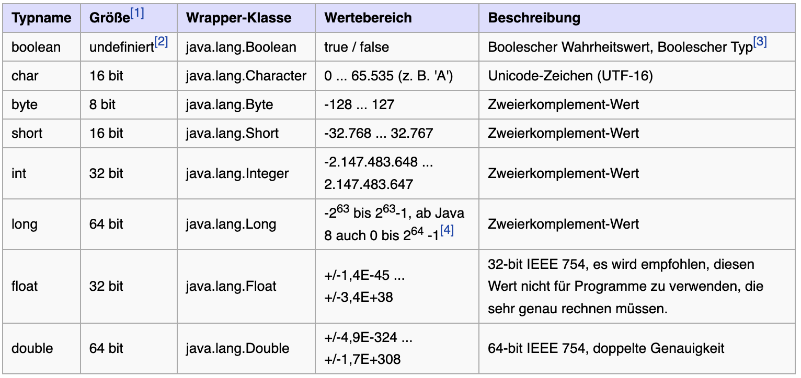
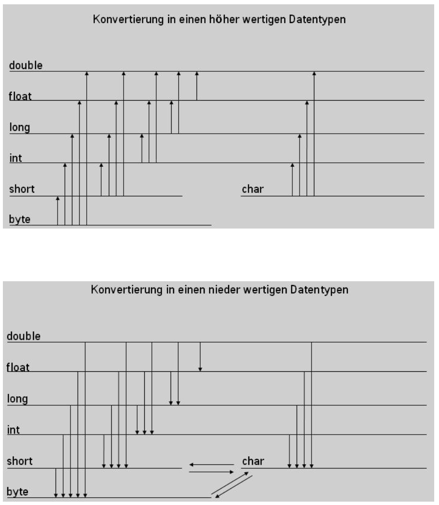
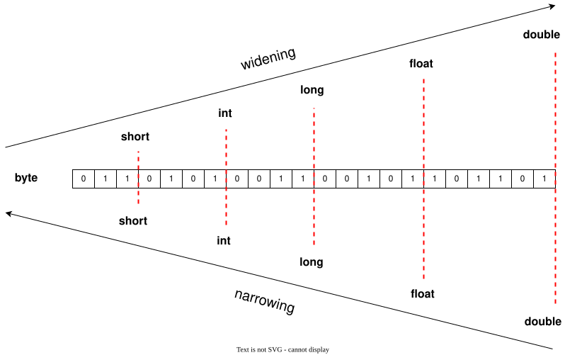

include::../../docs/settings.adoc[]
include::module-settings.adoc[]
:author: Thorsten Eckstein

// table of contents
:toc:

////
  Folgendes wird in "course-structure.adoc"
  aus jedem Modul zusammengeführt:

tag::content[]
----
1. Datentypen
1.1. Primitive Datentypen
1.2. Komplexe Datentypen
2. Typumwandlungen
2.1. Implizite Typumwandlung
2.2. Explizite Typumwandlung (Casting)
3. Typumwandlung von komplexen Datentypen (Klassen)
----
end::content[]
////

[[datatypes]]
== Datentypen

[[datatypes-primitives]]
=== Primitive Datentypen

Übersicht über die Datentypen in Java:

Quelle: -> https://de.wikibooks.org/wiki/Java_Standard:_Primitive_Datentypen[Wikibooks: Datatypes]

Quelle: -> https://docs.oracle.com/javase/tutorial/java/nutsandbolts/datatypes.html[Oracle: Datatypes]

[[datatypes-primitives-casting]]
=== Typumwandlungen primitiver Datentypen

*Type-Casting* mit primitiven Datentypen

Man unterscheidet zwischen einer *expliziten* und einer *impliziten* Typumwandlung.

CAUTION: _Bei der Umwandlung in "kleinere" Datentypen können Fehler auftreten (Informationsverlust), es findet das sogenannte "Narrowing" automatisch statt. Es entsteht zwar kein Compiler-Fehler, aber z.B. die Zahl wird verfälscht (-> https://docs.oracle.com/javase/specs/jls/se17/html/jls-5.html#jls-5.1.3[Narrowing])_

Eine andere Darstellung:

*Implizite Typumwandlung*

Die implizite Typumwandlung findet automatisch bei der Zuweisung statt. Dies geht jedoch nur, wenn ein niederwertiger Datentyp in einen höher wertigeren Datentypen umgewandelt wird, also z.B. vom Datentyp `int` in den Datentyp `long`:

[, java]
----
int wert1 = 10;
long wert2 = 30;
wert2 = wert1; // automatische Umwandlung
----

*Explizite Typumwandlung (Type Casting)*

Die explizite Umwandlung erfolgt durch den sogenannten `cast`-Operator mit runden Klammern. Hier wird von einem höher wertigeren Datentyp in einen nieder wertigen Datentypen umgewandelt. In welchen Datentyp umgewandelt werden soll, muss bei dem cast Operator explizit angegeben werden.

[, java]
----
int wert1 = 10;
float wert2 = 30.5f;
wert1 = (int) wert2; // Umwandlung per 'cast'
----

////
--------------------------------------------------------------
 ACHTUNG :: HIER GGF. UNTERBRECHUNG/LV-WECHSEL BERÜCKSICHTIGEN
--------------------------------------------------------------
////

[[datatypes-complex]]
=== Komplexe Datentypen (Klassen)

Komplexe Datentypen in Java sind Datentypen, die sich auf Objekte beziehen und in Form von Klassen implementiert werden. Im Gegensatz zu primitiven Datentypen sind sie nicht vordefiniert, sondern werden vom Entwickler gestaltet.

*Hauptarten von komplexen Datentypen*:

_Es gibt einerseits ..._

selbst-implementierte Klassen::
Dienen als Vorlage für Objekte und enthalten verschiedene Komponenten wie Namen, Attribute, Modifikatoren und Methoden.

_und andererseits von Java mitgelieferte Klassen wie ..._

Strings::
Ermöglichen die Darstellung von Abfolgen von Zeichen.

Arrays & Listen::
Ermöglichen das Speichern mehrerer Werte.

Interfaces::
Fungieren als Abstraktionen und definieren Schnittstellen für andere Klassen.

Enums::
Ermöglichen die Definition unveränderlicher Werte mit festgelegten Werten.

Wrapper (-Klassen)::
Für jeden primitiven Datentyp gibt es eine entsprechende Wrapper-Klasse, die neben dem Wert zusätzliche Methoden anbietet. Zum Beispiel:

[source, java]
----
int i = 42;
Integer j = 42; // Erzeugt ein Integer-Objekt
----

Komplexe Datentypen in Java bieten große Flexibilität bei der Strukturierung und Organisation von Daten. Sie ermöglichen die Erstellung von benutzerdefinierten Datenstrukturen und Objekten, was für die objektorientierte Programmierung von besonderer Bedeutung ist.

[[datatypes-complex-casting]]
=== Typumwandlungen komplexer Datentypen

====
IMPORTANT: Übergang zum Modul: Komplexe Datentypen in Form von Klassen -> <<../../module-classes/docs/classes.adoc#tdd, Klassen & Instanzen>>, dann ggf. wieder hierher zurück!
====

Auch *komplexe Datentypen* - also Instanzen von Java *Klassen* - können den Typen wechseln. Das ist natürlich ebenso klaren Regeln unterworfen.

So z.B. kann eine Klasse `Regionalzug` den Datentypen `Zug` bekommen, wenn die Klassen in einer Vererbungshierarchie stehen, ähnlich bei `Interfaces`. Das haben wir insb. schon im vorigen Modul `module-classes` gesehen und genutzt.

Das ist also insbesondere im Kontext der Vererbung interessant bzw. von Nutzen:

*Beispiel*:

[, java]
----
public class HumanBeing {
 public String name;
}

public class German extends HumanBeing {
  public String country;
}

HumanBeing human = new German();
human.name = "Johnny Walker"; <1>

German german = (German)human; <2>
german.country = "Germany";
----

<1> Zugriff auf das Feld `name` der abstrakten Klasse `Human Being`
<2> Zugriff auf das Feld `country` der konkreten Klasse `German` erst NACH dem *Down-Casting* möglich.

*Demo/Beispiele*:

[subs=normal]
 -> {mod-ref-test}/demo/DatatypesDemoTest.java

'''

*Übungen*:

Übung 1 - Typumwandlung/Casting::

[subs=normal]
 -> {mod-ref-test}/exercise/DatatypesExerciseTest.java

Schreibe je einen Test für

a. Gegeben `char c = '1'` -> Umwandlung in `int`
b. Gegeben `int i = 127` -> Umwandlung in `byte`

und prüfe das Ergebnis, also den erwarteten Wert, z.B. mithilfe von `System.out.println` oder mit der "Assertions-Methode" `assertEquals(<expected>, <actual>)`.

