include::../../docs/settings.adoc[]
include::module-settings.adoc[]
:author: Thorsten Eckstein

// table of contents
:toc:

////
  Folgendes wird in "course-structure.adoc"
  aus jedem Modul zusammengeführt:

tag::content[]
----
1. Welcome
2. Fachlicher Schwerpunkt des Kurses (Zugdisposition)
2.1. Kontext
2.2. Klassenmodell
3. Prozess der Softwareentwicklung
3. IDE Setup
3.1. Lokales Arbeitsverzeichnis: Der Workspace
3.2. Java Version
3.3. IDE IntelliJ
3.4. Quellcodeverwaltung: Git
3.5. Herunterladen der Kursinhalte (Git mit IntelliJ)
----
end::content[]
////

[[welcome]]
== Welcome

*Über mich*

[cols="2h,8", grid="none"]
|===

|  | *Thorsten Eckstein*

| Arbeitgeber     | Deutsche Bahn, ca. 335.000 Mitarbeiter

|                 | DB Systel GmbH, Frankfurt a.M., ca. 7.000 Mitarbeiter,  IT-Dienstleister der Deutschen Bahn

| Qualifikationen | Dipl. Geo-Informatik, zertifizierter Softwareentwickler, zertifizierter Softwarearchitekt, Lehrbeauftragter
|===

[[organisation]]
== Organisatorische Hinweise

Termine::
Die LVs sind wie immer im Google Kalender geplant

Anwesenheitspflicht::
Anwesenheit ist gewünscht, es findet aber keine Anwesenheitskontrolle statt. Bekannte Abwesenheiten bitte ankündigen und begründen.

Ablauf::
Wöchentliche LVs mit je 3 Zeitstunden und Pausen

LV Inhalte::
Die meisten Themen beinhalten regelmäßig Theorie, Demonstration, Übungen und Lösungsbesprechung.

Prüfung::
Details zur Prüfung werden im Laufe des Semesters, mit ausreichend Zeit bis zum Prüfungstermin, bekannt gegeben.

[[goals]]
== Ziele dieser Lehrveranstaltung

In der LV versuchen wir, folgenden *Ziele* zu erreichen:

icon:graduation-cap[role=green] *Haupt-Lernziele*

. Erarbeitung *grundlegender Fähigkeiten* in der Programmierung mit `Java`, also Umsetzung von Syntax, Regeln & Eigenschaften
. Kennenlernen des Umgangs mit üblichen *Tools* in der Softwareentwicklung (SWE)
. Erstellung funktions- und testfähiger *Applikationen*
. Training der *Denk-, Arbeits- und Vorgehensweisen* in der SWE mit Java

icon:graduation-cap[role=blue] *Neben-Lernziele*

. Verstehen der Objektorientierung
. Modellierung: Übersetzung von Fachlichkeit in Quellcode
. Abstraktionsvermögen trainieren
. Fortgeschrittene Sprachkonzepte kennenlernen
. "Keine Angst" vor Komplexität

[[domain]]
== Fachlicher Schwerpunkt des Kurses: Bahnbetrieb

[[domain-context]]
=== Kontext

Der *Betrieb* von Zügen kann grundsätzlich unterteilt werden in:

. *infrastrukturelle* Sicht (_Stammdaten_)
. *planerische* Sicht (_Bewegungsdaten, SOLL_)
. *operative* Sicht (_Bewegungsdaten, IST_)

Ein paar wichtige Begriffe:

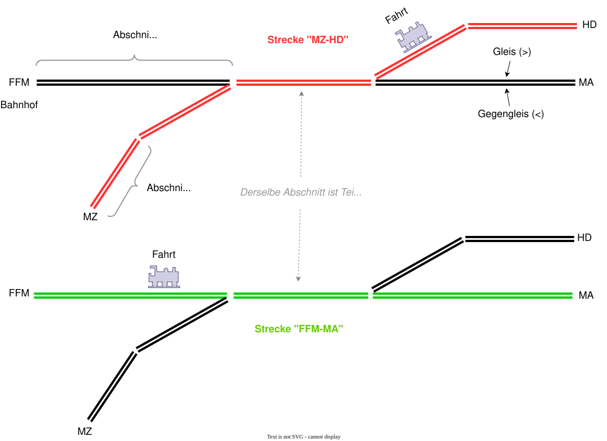

[[sneak-preview]]
=== Vorschau: Klassenmodell

Eine solche Fachlichkeit (s.o.) muss, um Applikationen zu erstellen, in (Fach-) *Klassenmodellen* abgebildet werden, z.B. mit folgenden Objekten:

----
 + Zug (Zugarten), Wagon (Wagonarten)
 + Strecke, Abschnitt, Gleis
 + Ereignisse: Abfahrt, Ankunft
 + Fahrt
 + Fahrplan
 + Fahrgast
 + Dispositionsmaßnahme, Umleitung

 und viele weitere ...
----

Beispiel für ein grundsätzliches *Fachklassenmodell* mit zwei "Geschmacksrichtungen":

(1) *Infrastrukturelle* Sicht (statische Sicht):

[plantuml, "Klassenmodell-1", png, align="center"]
....
include::diagrams/business-model-ist.puml[]
....

(2) *Planerische* Sicht (dynamische Sicht):

[plantuml, "Klassenmodell-2", png, align="center"]
....
include::diagrams/business-model-soll.puml[]
....

== Prozess der Softwareentwicklung

Der *agile Entwicklungsprozess* (agile Software Development) kann am besten mittels Grafik erläutert werden:

.Der agile Entwicklungsprozess
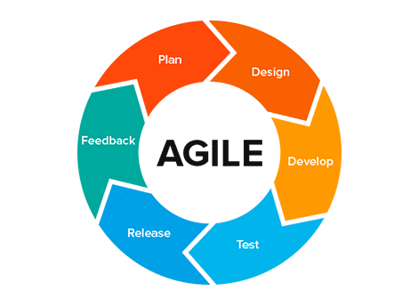

In allen Teilschritten des Prozesses werden viele verschiedene **Tools** eingesetzt, dazu gehören auch diese, die in dieser LV eingesetzt werden, vor allem:

* Entwicklungsumgebung `IntelliJ` (v.a. in Phasen "Design", "Develop" und "Test") sowie
* Quellcodeverwaltung `Git` (eigentlich in allen Phasen)

== IDE Setup

=== Lokales Arbeitsverzeichnis: Der `Workspace`

Zuerst wird ein *lokaler _Workspace_* eingerichtet, d.h. ein (separates) Wurzelverzeichnis, in das im Anschluss das die *Inhalte des Kurses*, d.h. SourceCode-Repository *gespeichert* werden können.

NOTE: _Natürlich kann man hier immer den persönlichen Präferenzen für dieses Wurzelverzeichnis folgen, für die Einrichtung des Kurses ist es aber besser, den Empfehlungen zu folgen ..._

Der Workspace - das *lokale Arbeitsverzeichnis*:

Zur Einrichtung eines Workspace unter *Windows* (11) nutzt man am besten einfach den `Explorer` und erzeugt ein neues Verzeichnis, zum Beispiel (_wird auch in späteren Beispielen genutzt_) das folgende:

 D:\Projekte

Wie gesagt, hierin werden die Kursinhalte in den nächsten Schritten dann lokal gespeichert und verwaltet (-> mittels `git`, siehe zugehöriges Kapitel).

////
.Einrichtung Workspace unter *Windows* (11)
[%collapsible]
====
*b)* mithilfe eines Terminals (oder auch `CMD` - "Command Line Prompt", könnte PowerShell sein), zum Starten z.B. einfach mit "Suche" nach dem Begriff "Terminal"

- Den aktuellen Pfad im Terminal prüfen

 dir
 => C:\Users\<your-name>

- Hier einen "Workspace" anlegen, d.h. ein Wurzelverzeichnis z.B. "Projekte":

 mkdir Projekte

- Also im Ergebnis:

 C:\Users\<your-name>\Projekte
====

.Einrichtung Workspace unter *MacOS* am Beispiel
[%collapsible]
====
- Terminal öffnen
- Den aktuellen Pfad im Terminal prüfen

 pwd
 => /Users/<your-name>

- Hier einen "Workspace" anlegen, d.h. ein Wurzelverzeichnis z.B. "Projekte":

 mkdir Projekte

- Also im Ergebnis:

 /Users/<your-name>/Projekte
====
////

=== `Java` Version

*Empfehlung*: Im Kurs soll folgende *Java* Version verwendet werden:

[indent=0]
----
include::../../pom.xml[tags="java-version"]
----

Ggf. muss diese Version noch installiert werden, wobei die Versionsnummern ("Minor") _hinter_ der Hauptversionsnummer 25 ("Major") nicht so wichtig sind.

Eine von mehreren Möglichkeiten, die aktuelle genutzte Java Version herauszufinden, ist:

- In den neuen Workspace, momentan noch leeren Ordner (s.o.), wechseln

 cd Projekte

- Hier ein Terminal/Kommando-Shell öffnen

- Prüfen, ob `java` vorhanden ist, einfach durch Eingabe von

 java -version

Dann sollte eine Java Version angezeigt werden.

Eine andere ist einfach innerhalb von IntelliJ, *nachdem* wir die LV-Inhalte bzw. das Gitlab-Repository heruntergeladen haben.

Ist dies erfolgt, kann man einfach hier schauen:

 Datei > Projektstruktur > SDKs

=== IDE `IntelliJ`

Die empfohlene IDE ist `IntelliJ`. Die LV-Inhalte sollten sowohl in der _Community_ als auch in der _Ultimate_ Edition funktionieren.

Der Code für den Kurs wurde mit folgender Version erstellt, die installiert sein sollte (falls noch nicht vorhanden, bitte installieren):

 >= IntelliJ IDEA 2025.2.3 (Enterprise/Community Edition)

Nicht zu große Abweichungen in der Version sollten kein Problem sein, die letzten Versionen sind in aller Regel untereinander kompatibel. Bei Problemen versucht man es einfach mit der aktuellsten IDE Version.

TIP: [small]#Alternativ könnte auch `MS Visual Studio Code` genutzt werden und diese Umgebung sollte auch bei der Einrichtung keine besonderen Probleme verursachen. Aber ... auf eigene Gefahr ;-), die Lehrveranstaltung wurde für IntelliJ vorbereitet!#

[big]#IntelliJ *PlugIns*#

Die PlugIns von IntelliJ finden sich hier über das Haupt-Menü:

 IntelliJ IDEA > Settings > PlugIns

*Bundled PlugIns*::
Mit IntelliJ werden bereits diverse PlugIns *automatisch mitinstalliert*, zu diesen gehören die folgenden. Sie sind für das Seminar erforderlich und sollen anfangs mal geprüft werden (Menü `IntelliJ > Settings > PlugIns`):

[cols="3l,7e", grid="none", frame="none"]
|===
| PlugIn Name | Kommentar

| Git & GitHub
| Version Control: Source Code Management, lokaler Git-Client

| Maven
| Build Tools: Build, Dependency & Project Management
|===

*Non-bundled PlugIns*::
Für den Quellcode, Tests und Dokumentation sind weitere PlugIns erforderlich, die _nicht_ mit IntelliJ installiert werden, also separat installiert werden müssen:

[cols="4a,3e,3m", grid="none", frame="none"]
|===
| PlugIn Name | Was ist das? | aktuelle Version

| image::images/asciidoc-plugin.png[]
| Einheitliche Erstellung von Dokumentationen, z.B. als PDF
| >= 0.44.x

| image::images/diagrams-net-plugin.png[]
| Erstellung von beliebigen Diagrammtypen
| >= 0.2.6

| image::images/plantuml-plugin.png[]
| Erstellung von UML-Diagrammen
| >= 7.13.x

|===
[small]#_PS: Ich persönlich aktualisiere IntelliJ selbst und auch die PlugIns in der Regel recht zeitnah._#

=== Quellcodeverwaltung: `Git`

Web: https://de.wikipedia.org/wiki/Git

*Git* ist ein sogenanntes _verteiltes_ Versionsverwaltungssystem für Quellcode und setzt folgenden *Workflow* um, bzw. bietet folgende Funktionen:

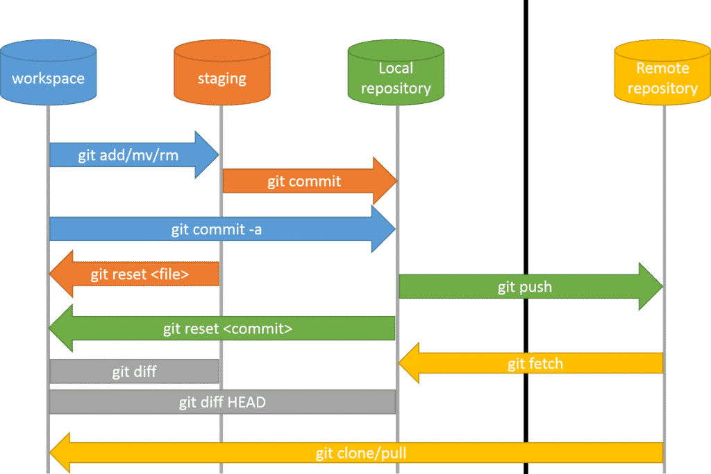

In dieser LV kommt aber nur ein kleiner Teil hiervon zum Einsatz, lediglich das erstmalige *Downloaden* (`clone`) & die regelmäßige *Aktualisierung* (`pull`) der lokalen Dateien wird benötigt:

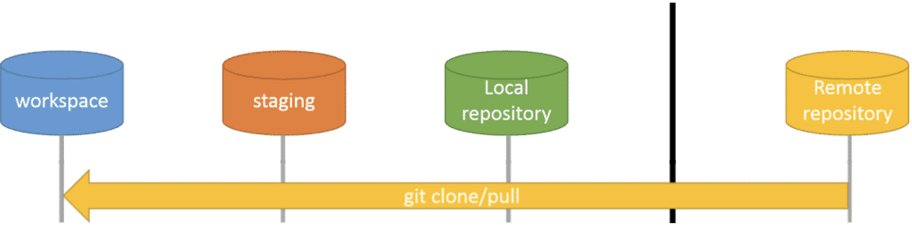

Das lokale Arbeitsverzeichnis wird `workspace` genannt. In diesem werden alle Quellcode-Dateien gespeichert, also z.B. das Verzeichnis, in das der Quellcode heruntergeladen wird:

In Windows bspw.:

[Beispiel]
 D:/Projekte

oder unter MacOS im Benutzerverzeichnis (aktueller Benutzer hier `<name>`)

 /Users/<name>/Projects

=== Herunterladen der Kursinhalte (Git mit IntelliJ)

[start=1]
. Über den Explorer/Finder in das eigene _Workspace_-Verzeichnis *wechseln*, z.B. `D:\Projekte`

. *IntelliJ starten*. Wenn zuvor kein anderes Projekt geladen war, dann kommt ...

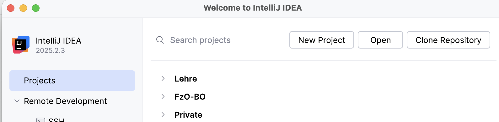

[start=3]
. Nun soll das Projekt von GtHub *heruntergeladen* werden, dazu gibt es 2 Varianten:

.. `Clone Repository` oder (in älteren Versionen) `Get from VCS` anklicken (VCS = Version Control System, `Git`)
+
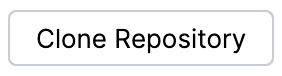 oder 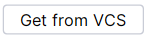
+
.. oder über die Menüoption `Git > clone ...` aufrufen (_falls bereits ein anderes Projekt in IntelliJ automatisch geladen wurde_)

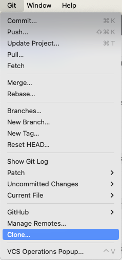

[start=4]
. In beiden Fälle erscheint der gleiche `clone`-*Dialog*, in dem die folgenden Angaben eingegeben werden müssen:

[subs=normal]
----
*URL*       : https://github.com/ThorstenEckstein/ma-wwi24ama
*Workspace* : <dein-lokales-Arbeitsverzeichnis>/ma-wwi24ama
----

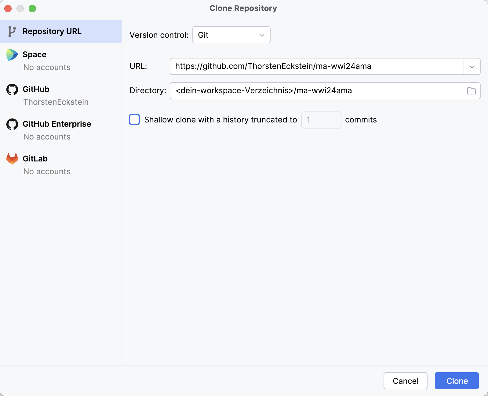

[start=5]
. Dann kommt (wahrscheinlich) eine Abfrage zur *"Vertrauenswürdigkeit"* -> `[Trust Project]`:

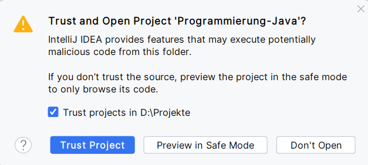

[start=6]
. Gegenenfalls muss noch entscheiden, ob das Projekt *in einem separaten Fenster* geöffnet werden soll -> `[New Window]`:

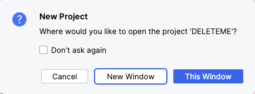

Nun sollte das heruntergeladene Projekt in Intellij vorhanden sein.

IMPORTANT: _Falls irgendetwas am Ende nicht so ist wie gedacht, kann das lokale Arbeitsverzeichnis einfach lokal gelöscht werden. Dann führt man die Schritte einfach nochmal durch._

Zur Überprüfung einmal (in der IDE) schauen, ob der richtige *Branch* namens

 hands-on

heruntergeladen wurde. Dies ist sozusagen eine spezielle Variante (oder auch Version), die im Semester genutzt wird.

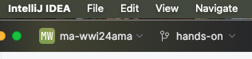

Ergebnis sollte jetzt sein, dass das Projekt für die LV in der IDE enthalten bzw. geladen ist.

////
(Optional) Ergänzend für *erfahrenere* Benutzer:

Es kann auch die _Kommandozeile_ genutzt werden, um das Repository zu klonen, dazu gibt es ein paar Tipps im folgenden Abschnitt, kann aber für den Moment ignoriert werden, es sei denn, das der Weg über IntelliJ nicht funktionieren sollte.

''''

[%collapsible, title="Aufklappen für _Git mit der Kommandozeile ..._"]
====
* Zuerst prüfen, ob `git` installiert ist. In der Kommandozeile geht dies durch

 git --version

* was zum Beispiel folgende Ausgabe ergibt: `git version 2.39.1`

* Dann in das lokale Arbeitsverzeichnis *wechseln* (oder neu anlegen), d.h. in den Workspace, z.B. nach ...

 cd D:/Projekte

* Innerhalb dieses Verzeichnisses wird das Repository *geklont*, d.h. heruntergeladen. Das Repository lautet:

 https://github.com/ThorstenEckstein/ma-wwi24ama

Dieses Repository wird geklont und damit zu einer lokalen Kopie im *Workspace* mit:

 git clone https://github.com/ThorstenEckstein/ma-wwi24ama.git -b hands-on <1>

<1> Der Branch-Name `hands-on` ist hier wichtig, das ist der exakte "Ort" in der Online-Quellcodeverwaltung (Repository), von dem aus heruntergeladen wird!

//Dann bitte direkt auf den Branch `hands-on` durch
// git checkout -b hands-on
// wechseln (kann man natürlich auch in der IDE/IntelliJ machen). In diesem Branch kann, sobald man ihn geklont hat, Code geschrieben werden, aber ...

* Zur Prüfung, auf welchem Branch man sich aktuell befindet, gibt man ein:

 git branch

* Hier sollte jetzt etwas Ähnliches erscheinen. Das Sternchen `*` zeigt an, welcher Branch gerade benutzt wird, das _soll_ hier auch so sein:

----
 * hands-on
----

CAUTION: ... es soll kein Code in das `remote` Repository *gepushed* werden, da es sonst zu Konflikten bei möglicherweise erforderlichen Updates (durch _pullen_) kommen kann!
====

._Hilfe zu bzw. Anzeige von Umgebungsvariablen_
[%collapsible]
====
- *PowerShell*: Umgebungsvariablen prüfen, um alle anzuzeigen

 gci env:

- oder um nur eine einzelne - hier der PATH - anzuzeigen:

 $env:PATH

- *CMD (Command Line Tool)*: Umgebungsvariablen prüfen, um alle anzuzeigen

 set

- oder um nur eine einzelne - hier der PATH - anzuzeigen:

 echo %Path%
====
////
